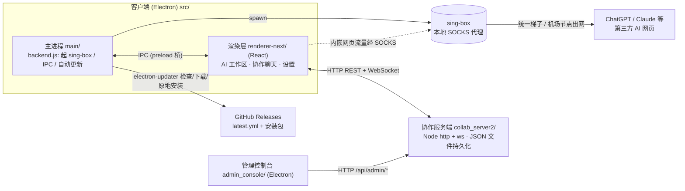

# 架构总览

ShareGPT 由三端组成：**客户端**（Electron 桌面应用）、**协作服务端**（`collab_server2/`）、**管理控制台**（`admin_console/`）。代理能力基于 [sing-box](https://sing-box.sagernet.org/)，自动更新基于 GitHub Releases。

## 各端职责

- **客户端 `src/`**
  - `main/`（纯 Node 主进程）：窗口与会话管理、内嵌 AI 网页的权限/路由拦截、`spawn` sing-box 做本地 SOCKS 代理、登录态/数据持久化、自动更新（`electron-updater`，Windows 原地无感）。核心在 `backend.js`、`appFactory.js`。
  - `renderer-next/`（React + TS）：AI 多标签工作区、协作聊天、用量统计、发送端/接收端设置。通过 `preload.js` 暴露的 IPC 与主进程通信。
- **协作服务端 `collab_server2/`**：单文件 `server.js`，纯 Node `http` + `ws`，零外部框架。负责账号、会话/Token、聊天消息（私聊/房间）、配置下发（`/api/client/bootstrap`）、版本信息。数据存本地 JSON（原子写）。可多实例（多群）：不同 `PORT` + 不同数据目录。
- **管理控制台 `admin_console/`**：独立 Electron，调用服务端 `/api/admin/*` 管理用户、下发 Sender/机场配置、查看反馈与漏走代理域名、发布版本。

## 关键协议 / 链路

| 链路                | 方式                  | 说明                                                                      |
| ------------------- | --------------------- | ------------------------------------------------------------------------- |
| 渲染层 ↔ 主进程     | Electron IPC          | 见 `src/main/preload.js` 暴露的 `api.*`                                   |
| 客户端 ↔ 协作服务端 | HTTP REST + WebSocket | 鉴权用 `Authorization: Bearer <token>`（非 cookie）；WS 推送在线状态/消息 |
| 内嵌 AI 网页 ↔ 外网 | sing-box SOCKS        | 仅 AI 站点按域名清单走代理；统一梯子或机场节点出网                        |
| 自动更新            | GitHub Releases       | 客户端读 `latest.yml`（Windows）/ 对比最新 tag；不经任何自建服务器        |

## 数据与持久化（服务端）

- `users.json` / `chat_history.json` / `gpt_usage.json` / `client_bootstrap.json` 等，均通过 `writeJsonAtomic`（temp + rename）写入，避免写一半损坏。
- 路径可经环境变量覆盖（`USERS_FILE` / `CHAT_HISTORY_FILE` / …），多群部署即指向不同目录。

> 内部草稿/历史设计文档见 [`docs/dev/`](dev/)。
