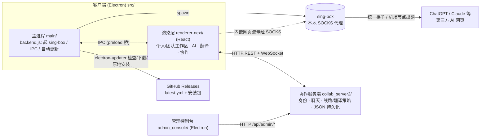

# 架构总览

ShareGPT 由三端组成：**客户端**（Electron 桌面应用）、**协作服务端**（`collab_server2/`）、**管理控制台**（`admin_console/`）。客户端可以使用完全本地的个人工作区，也可以连接自托管团队；代理能力基于 [sing-box](https://sing-box.sagernet.org/)，自动更新基于 GitHub Releases。

```mermaid
flowchart LR
  subgraph Client["客户端 (Electron) src/"]
    M["主进程 main/\nbackend.js: 起 sing-box / IPC / 自动更新"]
    R["渲染层 renderer-next/ (React)\n个人/团队工作区 · AI · 翻译 · 协作"]
    M <-->|"IPC (preload 桥)"| R
  end

  SB[("sing-box\n本地 SOCKS 代理")]
  AI["ChatGPT / Claude 等\n第三方 AI 网页"]
  M -->|spawn| SB
  R -.->|"内嵌网页流量经 SOCKS"| SB
  SB -->|"统一梯子 / 机场节点出网"| AI

  CS["协作服务端 collab_server2/\n身份 · 聊天 · 线路/翻译策略 · JSON 持久化"]
  R <-->|"HTTP REST + WebSocket"| CS

  AC["管理控制台 admin_console/ (Electron)"]
  AC -->|"HTTP /api/admin/*"| CS

  GH["GitHub Releases\nlatest.yml + 安装包"]
  M -->|"electron-updater 检查/下载/原地安装"| GH
```

## 各端职责

- **客户端 `src/`**
  - `main/`（纯 Node 主进程）：窗口与 `WebContentsView` 生命周期、持久 Chromium 分区、路由授权、`spawn` sing-box、受限 composer/翻译桥接和自动更新。核心在 `backend.js`、`appFactory.js`。
  - `renderer-next/`（React + TS）：首次使用引导、个人/团队工作区、AI 多标签与多环境、翻译、协作聊天和设置。通过 `preload.js` 暴露的受限 IPC 与主进程通信。
- **协作服务端 `collab_server2/`**：Node `http` + `ws` 服务。负责账号、会话、聊天、客户端 bootstrap、线路授权、托管翻译与用量。数据以原子写方式保存到独立 JSON 文件；不同实例必须使用不同端口、数据目录和翻译主密钥。
- **管理控制台 `admin_console/`**：独立 Electron，调用 `/api/admin/*` 管理用户、团队网络、多线路授权、各 AI 推荐线路、托管翻译、反馈和版本信息。

## 关键协议 / 链路

| 链路                | 方式                  | 说明                                                                      |
| ------------------- | --------------------- | ------------------------------------------------------------------------- |
| 渲染层 ↔ 主进程     | Electron IPC          | 见 `src/main/preload.js` 暴露的 `api.*`                                   |
| 客户端 ↔ 协作服务端 | HTTP REST + WebSocket | 鉴权用 `Authorization: Bearer <token>`（非 cookie）；WS 推送在线状态/消息 |
| 内嵌 AI 网页 ↔ 外网 | sing-box SOCKS        | 个人代理或团队授权线路；每个 AI 分区绑定明确线路并在变更时重新验证        |
| 自动更新            | GitHub Releases       | GitHub Latest Release tag 是版本权威；安装元数据不能覆盖不匹配的 tag      |

## 数据与持久化（服务端）

- `users.json`、`chat_history.json`、`gpt_usage.json`、`client_bootstrap.json`、`proxy_routes.json`、`translation_profiles.json`、`translation_usage.json` 等通过原子替换写入，避免留下半个 JSON 文件。
- 路径可经环境变量覆盖（`USERS_FILE` / `CHAT_HISTORY_FILE` / …），多群部署即指向不同目录。
- 翻译 API Key 只以 AES-256-GCM 密文保存在服务端，主密钥来自环境变量且不下发客户端；数据目录与主密钥都必须纳入受控备份。

## 继续维护

- 已实施功能、验证证据、服务器增量更新原则和踩坑记录：
  [`IMPLEMENTATION_HISTORY.md`](IMPLEMENTATION_HISTORY.md)
- 每次发布的构建与资产清单：[`RELEASING.md`](RELEASING.md)
- 浏览器数据清理、环境配置和网页可见信息边界：[`browser-privacy.md`](browser-privacy.md)
- 从空服务器开始自托管：[`SELF_HOSTING.md`](SELF_HOSTING.md)
