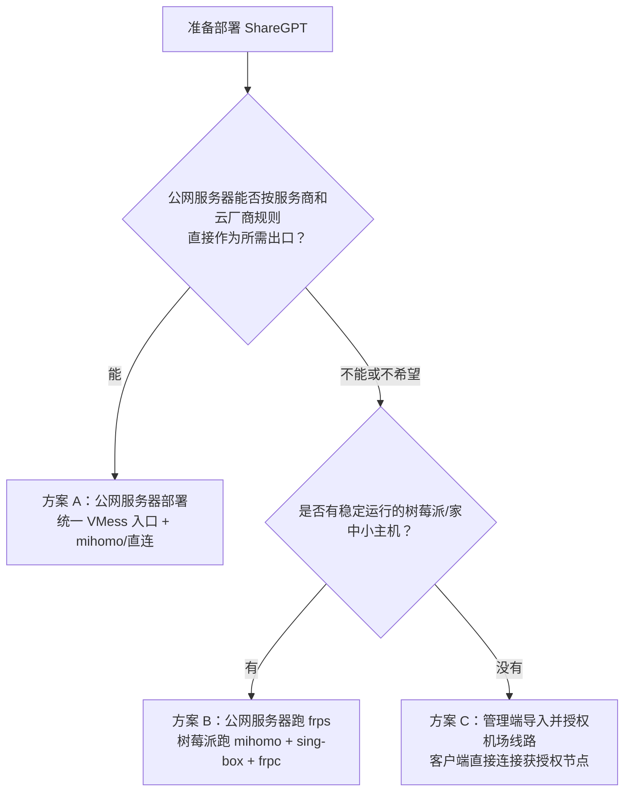
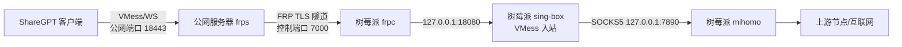
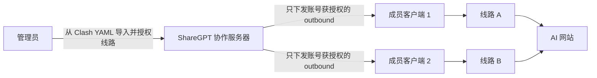

# ShareGPT 自托管完整教程：协作后端、统一出口、FRP 树莓派出口与节点分发

> 适用版本：ShareGPT `1.0.8` 及当前源码。本文面向服务器管理员，不面向普通客户端用户。`1.0.9` 尚未发布，部署候选源码时必须锁定经过你验证的完整提交 SHA。
>
> 文中的域名、IP、端口、UUID、Token、密码和订阅地址全部是占位符。请替换为你自己的值，不要把真实凭据提交到 Git、Issue、截图或聊天记录中。

本文从一台空的 Ubuntu 服务器开始，完成下面四件事：

1. 部署 ShareGPT 协作后端，并用 HTTPS 提供登录、聊天、配置同步和管理接口。
2. 根据网络条件，在两种“统一出口”拓扑中选择一种：
   - **方案 A：公网服务器直接作为出口**；
   - **方案 B：公网服务器只做 FRP 入口，树莓派运行 mihomo 并作为出口机**。
3. 把统一出口参数通过 ShareGPT 管理端下发给客户端。
4. 如不想维护统一出口，改用“机场节点分发”模式，把一个 Clash 节点下发给本群客户端。

本文不仅给出配置，还给出逐层验证、失败回滚、备份恢复和常见故障定位方法。

## 阅读路线

- 只搭协作后端：完成第 1–11 节。
- 公网服务器直接提供统一出口：再完成第 12–15、20–22 节。
- 公网服务器 + 树莓派 + FRP：再完成第 12–13、16–22 节。
- 按成员授权并下发机场线路：完成第 1–11、23–25 节。
- 已经部署但出现故障：直接查看第 26–36 节。

---

## 1. 先理解三个容易混淆的概念

### 1.1 协作服务器不是代理出口

ShareGPT 协作服务器负责：

- 用户登录与管理员认证；
- 聊天、日历、笔记同步和使用统计；
- 下发客户端默认配置；
- 下发可选的机场节点。

它默认监听 `8088`，生产环境应由 Caddy/Nginx 通过 HTTPS 反向代理。它本身不会替 AI 网页流量出网。

### 1.2 入口 IP 不一定是网站看到的出口 IP

- **入口 IP**：ShareGPT 客户端连接的公网服务器地址。
- **出口 IP**：ChatGPT、Claude、Gemini 最终看到的公网 IP。

在“公网服务器 + FRP + 树莓派”拓扑中，公网服务器只负责接收和转发连接。网站看到的是树莓派的直连公网 IP，或者树莓派上 mihomo 当前选中节点的 IP，**不是 FRP 公网服务器的 IP**。

部署完成后必须通过 ShareGPT 的网页可见信息表盘，或通过代理执行 `curl https://api.ipify.org`，确认真实出口。

### 1.3 “统一梯子”和“机场节点”是两条不同链路

| 模式     | 客户端连接方式                                           | 节点凭据是否下发到客户端            | 适合情况                                   |
| -------- | -------------------------------------------------------- | ----------------------------------- | ------------------------------------------ |
| 统一梯子 | 客户端 → VMess/WebSocket 统一入口 → 出口机 → mihomo/直连 | 客户端只拿统一入口地址、端口和 UUID | 推荐；需要统一运维、固定入口、集中换节点   |
| 机场节点 | 客户端直接连接管理员下发的 SS/VMess/Trojan/VLESS 节点    | 是；节点出站配置会同步给本群客户端  | 搭建最快；能够接受节点配置出现在成员设备上 |

当前 1.0.x 客户端的统一梯子协议是固定的 **VMess + WebSocket**。服务端入站必须与客户端生成的配置保持一致。

---

## 2. 选择拓扑



推荐顺序：

1. 有合规、稳定的公网出口服务器：选方案 A，组件最少。
2. 公网服务器不适合运行代理出口，但有树莓派或家中小主机：选方案 B。
3. 不想维护出口机和 FRP：选方案 C。

> 请遵守所在地区法律、云服务器提供商规则及第三方 AI 服务条款。若云厂商禁止代理或中继用途，不要在该服务器上运行或转发相关流量；FRP 只做中继也不代表一定符合云厂商政策。

---

## 3. 规划域名、端口与密钥

下面的教程使用这些示例值：

| 用途                  | 示例                 | 对外开放                 |
| --------------------- | -------------------- | ------------------------ |
| 协作服务域名          | `collab.example.com` | TCP `80/443`             |
| 协作服务本机端口      | `127.0.0.1:8088`     | 否                       |
| 统一出口入口域名/IP   | `edge.example.com`   | TCP `18443`              |
| 统一 VMess 公网端口   | `18443`              | 是                       |
| 出口机 VMess 本地端口 | `18080`              | 仅方案 B 本机            |
| mihomo mixed 端口     | `127.0.0.1:7890`     | 否                       |
| frps 控制端口         | `7000`               | 仅方案 B；树莓派需能访问 |
| mihomo 控制 API       | `127.0.0.1:9090`     | 否                       |

建议协作服务和代理入口使用不同子域名。它们可以在同一台公网服务器上，但不是同一项服务。

在方案 A/B 中，把 `edge.example.com` 的 DNS A/AAAA 记录指向提供统一入口的公网服务器。这个域名只用于 TCP 连接定位；当前 1.0.x 统一梯子没有配置 TLS，因此不需要给 `edge.example.com` 配置 Caddy 站点或 HTTPS 证书。若 DNS 托管在 Cloudflare 等 CDN，必须使用“仅 DNS/DNS only”，普通 CDN 代理不会转发任意 `18443` TCP 流量。

生成密钥：

```bash
# VMess UUID：稍后安装 sing-box 后也可以运行 sing-box generate uuid
cat /proc/sys/kernel/random/uuid

# FRP Token
openssl rand -hex 32

# mihomo API Secret（仅本机使用，但仍应设置）
openssl rand -hex 32
```

将结果保存在密码管理器中。下文使用：

- `<VMESS_UUID>`
- `<FRP_TOKEN>`
- `<MIHOMO_API_SECRET>`

---

# 第一部分：部署 ShareGPT 协作后端

## 4. 准备公网服务器

推荐环境：

- Ubuntu 22.04/24.04 x86_64；
- 1 核 CPU、1 GB 内存可供小组试用；
- 一个已解析到服务器公网 IP 的域名 `collab.example.com`；
- 能使用 `sudo` 的普通用户；
- Node.js 22.12 或更高版本。

先更新系统并安装基础工具：

```bash
sudo apt update
sudo apt install -y ca-certificates curl git jq rsync ufw
```

检查 Node.js：

```bash
node -v
```

若没有 Node.js，或版本低于 22.12，可安装 Node.js 22：

```bash
curl -fsSL https://deb.nodesource.com/setup_22.x | sudo -E bash -
sudo apt install -y nodejs
node -v
npm -v
```

## 5. 创建专用用户、源码目录和数据目录

不要用 root 直接运行协作服务。源码与运行数据应分开，避免 `git pull` 或重新部署误删用户数据。

```bash
sudo useradd --system --home /opt/sharegpt --create-home --shell /usr/sbin/nologin sharegpt
sudo mkdir -p /opt/sharegpt /var/lib/sharegpt-collab /etc/sharegpt-collab
sudo chown -R sharegpt:sharegpt /opt/sharegpt /var/lib/sharegpt-collab
sudo chown root:sharegpt /etc/sharegpt-collab
sudo chmod 750 /var/lib/sharegpt-collab /etc/sharegpt-collab
```

下载源码并只安装协作服务的生产依赖：

```bash
sudo -u sharegpt git clone https://github.com/Sjeary/ShareGPT.git /opt/sharegpt/source
sudo -u sharegpt git -C /opt/sharegpt/source checkout --detach v1.0.8
sudo -u sharegpt npm --prefix /opt/sharegpt/source/collab_server2 ci --omit=dev
```

部署时必须先切到你验证过的不可变 tag 或提交，再安装该版本的依赖，不能永远跟随 `main`。
上面的 `v1.0.8` 是本文更新时最新的正式 Release。`1.0.9` 仍处于候选阶段，因此不要使用不存在的 `v1.0.9` tag；若需要验证候选能力，请把 `v1.0.8` 替换为经过审核的完整 40 位提交 SHA，并在正式发布后切换到真实 tag。

正式暴露服务前执行生产依赖审计：

```bash
sudo -u sharegpt npm --prefix /opt/sharegpt/source/collab_server2 audit --omit=dev
```

若出现 high/critical，不要忽略后直接上线；应选择包含修复的 Release/提交，重新执行 `npm ci`、服务端测试和兼容验证。本文记录的版本不代表依赖会永久保持无漏洞。

## 6. 创建后端环境文件

编辑 `/etc/sharegpt-collab/server.env`：

```bash
sudoedit /etc/sharegpt-collab/server.env
```

写入：

```ini
NODE_ENV=production
HOST=127.0.0.1
PORT=8088

USERS_FILE=/var/lib/sharegpt-collab/users.json
CHAT_HISTORY_FILE=/var/lib/sharegpt-collab/chat_history.json
GPT_USAGE_FILE=/var/lib/sharegpt-collab/gpt_usage.json
CLIENT_BOOTSTRAP_FILE=/var/lib/sharegpt-collab/client_bootstrap.json
CALENDARS_FILE=/var/lib/sharegpt-collab/calendars.json
USER_STORES_FILE=/var/lib/sharegpt-collab/user_stores.json
FOCUS_FILE=/var/lib/sharegpt-collab/focus_stats.json
AIRPORT_FILE=/var/lib/sharegpt-collab/airport.json
PROXY_ROUTES_FILE=/var/lib/sharegpt-collab/proxy_routes.json
PROXY_ROUTE_HEALTH_FILE=/var/lib/sharegpt-collab/proxy_route_health.json

TRANSLATION_PROFILES_FILE=/var/lib/sharegpt-collab/translation_profiles.json
TRANSLATION_USAGE_FILE=/var/lib/sharegpt-collab/translation_usage.json
SHAREGPT_TRANSLATION_MASTER_KEY=<32_BYTE_HEX_OR_BASE64_KEY>

RELEASES_DIR=/var/lib/sharegpt-collab/releases
RELEASE_STORE=/var/lib/sharegpt-collab/release_shared
SHARED_RELEASE_FILE=/var/lib/sharegpt-collab/release_shared/release.json

SESSION_TTL_MS=86400000
HISTORY_MAX=2000
GPT_USAGE_MAX=50000
MAX_ATTACHMENTS_PER_MESSAGE=4
MAX_ATTACHMENT_BYTES=31457280
# 通常不必设置 MAX_CHAT_PAYLOAD_BYTES；服务会根据上面两项计算安全且可用的协议上限。
LOGIN_MAX_FAILS=10
LOGIN_LOCK_MS=900000

CORS_ORIGIN=*
```

不要在生产环境把 `HOST` 改回 `0.0.0.0`。Caddy 与 Node 在同一台机器时，只让 Node 监听回环地址即可。

当前桌面客户端和管理端从 Electron 本地页面发起请求，来源可能表现为 `file://`/`null`；服务端只支持一个固定的 `Access-Control-Allow-Origin` 字符串，不能同时维护多来源白名单。因此这里保留 `*`，但所有业务接口仍使用 Bearer Token/管理员会话鉴权，且 Node 端口只监听回环地址。CORS 不是身份认证，也不能替代 HTTPS、Token 和防火墙。

使用 `openssl rand -base64 32` 生成翻译主密钥，替换占位符后再启动服务。该密钥用于 AES-256-GCM 加密管理员保存的翻译 API Key，不能提交到 Git、发送给客户端或与数据备份放在同一未加密位置；密钥丢失后现有翻译配置无法解密。

保护环境文件：

```bash
sudo chown root:sharegpt /etc/sharegpt-collab/server.env
sudo chmod 640 /etc/sharegpt-collab/server.env
```

## 7. 创建 systemd 服务

编辑 `/etc/systemd/system/sharegpt-collab.service`：

```ini
[Unit]
Description=ShareGPT Collaboration Server
After=network-online.target
Wants=network-online.target

[Service]
Type=simple
User=sharegpt
Group=sharegpt
WorkingDirectory=/opt/sharegpt/source/collab_server2
EnvironmentFile=/etc/sharegpt-collab/server.env
ExecStart=/usr/bin/node /opt/sharegpt/source/collab_server2/server.js
Restart=always
RestartSec=3
TimeoutStopSec=20
UMask=0077
NoNewPrivileges=true
PrivateTmp=true
ProtectSystem=strict
ProtectHome=true
ReadWritePaths=/var/lib/sharegpt-collab

[Install]
WantedBy=multi-user.target
```

先做语法检查，再启动：

```bash
sudo -u sharegpt /usr/bin/node --check /opt/sharegpt/source/collab_server2/server.js
sudo systemctl daemon-reload
sudo systemctl enable --now sharegpt-collab
sudo systemctl status sharegpt-collab --no-pager
```

本机健康检查：

```bash
curl -fsS http://127.0.0.1:8088/api/health | jq
```

预期返回包含：

```json
{
  "ok": true,
  "serverTime": "...",
  "online": 0,
  "sessions": 0
}
```

如果失败，先看日志：

```bash
sudo journalctl -u sharegpt-collab -n 100 --no-pager
```

## 8. 使用 Caddy 提供 HTTPS 和 WebSocket

安装 Caddy 官方 Debian/Ubuntu 软件源版本：

```bash
sudo apt install -y debian-keyring debian-archive-keyring apt-transport-https curl
curl -1sLf 'https://dl.cloudsmith.io/public/caddy/stable/gpg.key' \
  | sudo gpg --dearmor -o /usr/share/keyrings/caddy-stable-archive-keyring.gpg
curl -1sLf 'https://dl.cloudsmith.io/public/caddy/stable/debian.deb.txt' \
  | sudo tee /etc/apt/sources.list.d/caddy-stable.list
sudo chmod o+r /usr/share/keyrings/caddy-stable-archive-keyring.gpg
sudo chmod o+r /etc/apt/sources.list.d/caddy-stable.list
sudo apt update
sudo apt install -y caddy
```

确认 `collab.example.com` 的 DNS A/AAAA 记录已经指向本机，然后编辑 `/etc/caddy/Caddyfile`：

```caddyfile
collab.example.com {
    encode zstd gzip
    reverse_proxy 127.0.0.1:8088
}
```

Caddy 的 `reverse_proxy` 会自动处理 WebSocket Upgrade，不需要额外配置 `/ws`。

验证并重载：

```bash
sudo caddy validate --config /etc/caddy/Caddyfile
sudo systemctl reload caddy
sudo systemctl status caddy --no-pager
curl -fsS https://collab.example.com/api/health | jq
```

如果服务器已有 Caddy 配置，不要整文件覆盖；把上面的站点块合并进去，再执行 `caddy validate`。

若证书申请失败，检查：

```bash
dig +short collab.example.com
sudo ss -lntp | grep -E ':(80|443|8088)\b'
sudo journalctl -u caddy -n 100 --no-pager
```

## 9. 配置防火墙

协作服务只需要公开 SSH、HTTP 和 HTTPS；`8088` 不应暴露到公网。

```bash
sudo ufw allow OpenSSH
sudo ufw allow 80/tcp
sudo ufw allow 443/tcp
sudo ufw deny 8088/tcp
sudo ufw enable
sudo ufw status numbered
```

云服务器还需要在安全组中做相同限制。系统防火墙与云安全组是两层配置，缺一不可。

从另一台机器验证 `8088` 没有暴露：

```bash
nc -vz <服务器公网IP> 8088
```

这里应该连接失败；但下面应该成功：

```bash
curl -fsS https://collab.example.com/api/health
```

## 10. 创建第一个管理员

### 方法一：管理端初始化

在管理员自己的 Windows/macOS 电脑上构建管理端：

```bash
git clone https://github.com/Sjeary/ShareGPT.git
cd ShareGPT/admin_console
npm install
npm run dist:win   # Windows
# 或 npm run dist:mac
```

打开 ShareGPT Admin，填写：

- 服务地址：`https://collab.example.com`
- 管理员用户名和强密码
- 点击“首次初始化管理员”

该按钮只有在服务器还没有可用管理员时才能成功。初始化后，后续使用“登录管理后台”。

### 方法二：服务器命令行创建

这种方式不会通过网络发送初始密码：

```bash
read -rsp '管理员密码: ' ADMIN_PASS; echo
sudo -u sharegpt env USERS_FILE=/var/lib/sharegpt-collab/users.json \
  node /opt/sharegpt/source/collab_server2/add_user.js admin "$ADMIN_PASS" --admin
unset ADMIN_PASS
```

普通用户可以在管理端创建，也可使用相同命令但去掉 `--admin`。

## 11. 客户端先验证协作后端

在 ShareGPT 客户端登录页填写：

- 服务地址：`https://collab.example.com`
- 用户名：管理员创建的普通用户
- 密码：对应密码

此时先不要开启代理。确认：

- 登录成功；
- 协作聊天显示在线；
- 服务端日志没有持续 401/500；
- 关闭并重新打开客户端后仍能重新连接。

到这里，协作后端已经独立可用。下面再部署代理出口。

---

# 第二部分：安装出口机公共组件

方案 A 和方案 B 的出口机都需要 mihomo 与 sing-box。方案 A 的出口机就是公网服务器；方案 B 的出口机是树莓派。

## 12. 安装 mihomo

先识别架构：

```bash
uname -m
```

常见映射：

| `uname -m`          | mihomo 资产关键词        |
| ------------------- | ------------------------ |
| `x86_64`            | `linux-amd64-compatible` |
| `aarch64` / `arm64` | `linux-arm64`            |
| `armv7l`            | `linux-armv7`            |

下面的命令从 mihomo 官方 GitHub Release 自动选择当前架构的最新稳定资产。生产环境第一次验证后应记录版本和 SHA-256，不要在无人值守时自动升级到未知版本。

```bash
sudo apt install -y curl jq gzip

case "$(uname -m)" in
  x86_64) MIHOMO_ASSET='mihomo-linux-amd64-compatible-.*\.gz$' ;;
  aarch64|arm64) MIHOMO_ASSET='mihomo-linux-arm64-.*\.gz$' ;;
  armv7l) MIHOMO_ASSET='mihomo-linux-armv7-.*\.gz$' ;;
  *) echo "不支持的架构: $(uname -m)"; exit 1 ;;
esac

MIHOMO_URL="$(curl -fsSL https://api.github.com/repos/MetaCubeX/mihomo/releases/latest \
  | jq -r --arg re "$MIHOMO_ASSET" '.assets[] | select(.name | test($re)) | .browser_download_url' \
  | head -n 1)"

test -n "$MIHOMO_URL"
curl -fL --retry 3 "$MIHOMO_URL" -o /tmp/mihomo.gz
gzip -dc /tmp/mihomo.gz | sudo tee /usr/local/bin/mihomo >/dev/null
sudo chmod 0755 /usr/local/bin/mihomo
mihomo -v
```

创建目录和服务用户：

```bash
sudo useradd --system --home /var/lib/mihomo --create-home --shell /usr/sbin/nologin mihomo
sudo mkdir -p /etc/mihomo /var/lib/mihomo
sudo chown -R mihomo:mihomo /var/lib/mihomo
sudo chown root:mihomo /etc/mihomo
sudo chmod 750 /etc/mihomo /var/lib/mihomo
```

### 12.1 导入你有权使用的 Clash/mihomo 配置

把订阅生成的完整 Clash YAML 保存为 `/etc/mihomo/config.yaml`。不要把订阅 URL 直接写入公开文档或 shell 历史。

```bash
sudoedit /etc/mihomo/config.yaml
```

确认配置顶层包含或修改为：

```yaml
mixed-port: 7890
allow-lan: false
bind-address: 127.0.0.1
mode: rule
log-level: info
ipv6: false
external-controller: 127.0.0.1:9090
secret: "<MIHOMO_API_SECRET>"
```

注意：如果订阅文件已经有这些键，请**替换原值**，不要在 YAML 末尾重复添加同名键。

`mode: rule` 时还要检查订阅的最后一条规则能否把目标流量送到预期代理组，例如 `MATCH,PROXY`。如果最后落到 `DIRECT`，部分 AI 流量会使用出口机本身 IP，而不是选中的节点。也可以使用 `mode: global` 并在 mihomo 的 `GLOBAL` 组中固定选择一个节点。无论使用哪种方式，都必须以后面的 `api.ipify.org` 实测结果为准。

安全要求：

- `mixed-port` 必须只绑定 `127.0.0.1`；
- `allow-lan` 保持 `false`；
- 不要在防火墙开放 `7890` 或 `9090`；
- 订阅、节点密码和 API Secret 只允许 root/mihomo 读取。

```bash
sudo chown root:mihomo /etc/mihomo/config.yaml
sudo chmod 640 /etc/mihomo/config.yaml
sudo -u mihomo mihomo -t -f /etc/mihomo/config.yaml -d /var/lib/mihomo
```

创建 `/etc/systemd/system/mihomo.service`：

```ini
[Unit]
Description=mihomo local upstream proxy
After=network-online.target
Wants=network-online.target

[Service]
Type=simple
User=mihomo
Group=mihomo
ExecStart=/usr/local/bin/mihomo -f /etc/mihomo/config.yaml -d /var/lib/mihomo
Restart=always
RestartSec=5
LimitNOFILE=1048576
NoNewPrivileges=true
PrivateTmp=true

[Install]
WantedBy=multi-user.target
```

启动并检查：

```bash
sudo systemctl daemon-reload
sudo systemctl enable --now mihomo
sudo systemctl status mihomo --no-pager
sudo ss -lntp | grep -E ':(7890|9090)\b'
```

两个端口都应只显示 `127.0.0.1`。

验证 mihomo 自身出口：

```bash
curl --connect-timeout 10 --max-time 30 \
  --proxy socks5h://127.0.0.1:7890 \
  https://api.ipify.org; echo

curl --connect-timeout 10 --max-time 30 \
  --proxy socks5h://127.0.0.1:7890 \
  -I https://chatgpt.com
```

只要能建立连接并收到 HTTP 响应，就说明 mihomo 基础链路可用；状态码不一定是 `200`，因为网站可能返回跳转或验证页面。

## 13. 安装 sing-box

使用 sing-box 官方 Release 的 Debian 包：

```bash
case "$(uname -m)" in
  x86_64) SINGBOX_ASSET='sing-box_.*_linux_amd64\.deb$' ;;
  aarch64|arm64) SINGBOX_ASSET='sing-box_.*_linux_arm64\.deb$' ;;
  armv7l) SINGBOX_ASSET='sing-box_.*_linux_armhf\.deb$' ;;
  *) echo "不支持的架构: $(uname -m)"; exit 1 ;;
esac

SINGBOX_URL="$(curl -fsSL https://api.github.com/repos/SagerNet/sing-box/releases/latest \
  | jq -r --arg re "$SINGBOX_ASSET" '.assets[] | select(.name | test($re)) | .browser_download_url' \
  | head -n 1)"

test -n "$SINGBOX_URL"
curl -fL --retry 3 "$SINGBOX_URL" -o /tmp/sing-box.deb
sudo apt install -y /tmp/sing-box.deb
sing-box version
```

创建运行用户与目录：

```bash
sudo useradd --system --home /var/lib/sharegpt-relay --create-home --shell /usr/sbin/nologin sharegpt-relay
sudo mkdir -p /etc/sharegpt-relay /var/lib/sharegpt-relay
sudo chown -R sharegpt-relay:sharegpt-relay /var/lib/sharegpt-relay
sudo chown root:sharegpt-relay /etc/sharegpt-relay
sudo chmod 750 /etc/sharegpt-relay /var/lib/sharegpt-relay
```

接下来根据方案 A 或 B 写不同的 sing-box 监听地址。

---

# 第三部分：方案 A——公网服务器直接作为统一出口

## 14. 方案 A 架构


如果 mihomo 选择代理节点，网站看到的是该节点的出口 IP；如果 mihomo 使用 `DIRECT`，网站看到的是公网服务器自身 IP。

## 15. 配置公网 sing-box 入站

编辑 `/etc/sharegpt-relay/singbox-server.json`：

```json
{
  "log": { "level": "info", "timestamp": true },
  "inbounds": [
    {
      "type": "vmess",
      "tag": "vmess_in",
      "listen": "0.0.0.0",
      "listen_port": 18443,
      "users": [{ "uuid": "<VMESS_UUID>" }],
      "transport": {
        "type": "ws",
        "path": "",
        "max_early_data": 2048,
        "early_data_header_name": "Sec-WebSocket-Protocol"
      }
    }
  ],
  "outbounds": [
    {
      "type": "socks",
      "tag": "forward",
      "server": "127.0.0.1",
      "server_port": 7890
    }
  ],
  "route": {
    "final": "forward",
    "auto_detect_interface": true
  }
}
```

这里的 transport 字段必须与当前 1.0.x 客户端保持一致。`path` 不要自行改成 `/sharegpt`，否则当前客户端无法连接。

> 当前客户端的统一梯子出站没有配置 TLS，`18443` 只是示例高位端口，并不表示这是 HTTPS。不要把这个端口直接放到 Caddy 的 HTTPS 站点后面，也不要自行给服务端入站增加 `tls`，否则现有 1.0.x 客户端会不兼容。若后续客户端增加 TLS/server name 支持，应再统一升级两端配置。

保护并检查配置：

```bash
sudo chown root:sharegpt-relay /etc/sharegpt-relay/singbox-server.json
sudo chmod 640 /etc/sharegpt-relay/singbox-server.json
sudo -u sharegpt-relay sing-box check -c /etc/sharegpt-relay/singbox-server.json
```

创建 `/etc/systemd/system/sharegpt-relay.service`：

```ini
[Unit]
Description=ShareGPT unified VMess relay
After=network-online.target mihomo.service
Wants=network-online.target
Requires=mihomo.service

[Service]
Type=simple
User=sharegpt-relay
Group=sharegpt-relay
ExecStart=/usr/bin/sing-box run -c /etc/sharegpt-relay/singbox-server.json
Restart=always
RestartSec=3
NoNewPrivileges=true
PrivateTmp=true

[Install]
WantedBy=multi-user.target
```

启动并开放统一入口端口：

```bash
sudo systemctl daemon-reload
sudo systemctl enable --now sharegpt-relay
sudo systemctl status sharegpt-relay --no-pager
sudo ufw allow 18443/tcp
sudo ss -lntp | grep ':18443\b'
```

云安全组也必须允许 TCP `18443`。

### 15.1 公网服务器本身直接出网，不使用 mihomo

若服务器本身就是你有权使用的稳定出口，可以把 `outbounds` 改成：

```json
"outbounds": [
  { "type": "direct", "tag": "forward" }
]
```

此时可以移除 `Requires=mihomo.service`，网站看到的将是该服务器的出口 IP。修改后必须再次运行 `sing-box check` 并重启服务。

---

# 第四部分：方案 B——公网服务器 + FRP + 树莓派出口

## 16. 方案 B 架构

这个方案适用于：

- 公网服务器只适合做入口或中继；
- 真正的 mihomo/上游代理运行在家中树莓派；
- 树莓派没有公网 IP，或者位于运营商 NAT 后面；
- 希望更换树莓派上的节点时，成员客户端无需修改公网入口地址。



公网服务器不需要安装 mihomo 或 sing-box，只运行 `frps`。树莓派运行 mihomo、sing-box 和 `frpc`。

## 17. 在公网服务器安装 frps

从 frp 官方 Release 下载当前架构版本，并校验官方 SHA-256 文件：

```bash
sudo apt install -y curl jq tar coreutils

FRP_BINARY="${FRP_BINARY:-frps}"

case "$(uname -m)" in
  x86_64) FRP_ARCH=amd64 ;;
  aarch64|arm64) FRP_ARCH=arm64 ;;
  armv7l) FRP_ARCH=arm ;;
  *) echo "不支持的架构: $(uname -m)"; exit 1 ;;
esac

FRP_API=https://api.github.com/repos/fatedier/frp/releases/latest
FRP_URL="$(curl -fsSL "$FRP_API" \
  | jq -r --arg arch "$FRP_ARCH" '.assets[] | select(.name | test("linux_" + $arch + "\\.tar\\.gz$")) | .browser_download_url' \
  | head -n 1)"
FRP_SHA_URL="$(curl -fsSL "$FRP_API" \
  | jq -r '.assets[] | select(.name == "frp_sha256_checksums.txt") | .browser_download_url')"

test -n "$FRP_URL" && test -n "$FRP_SHA_URL"
FRP_TMP_DIR="$(mktemp -d)"
trap 'rm -rf "$FRP_TMP_DIR"' EXIT
curl -fL --retry 3 "$FRP_URL" -o "$FRP_TMP_DIR/frp.tar.gz"
curl -fL --retry 3 "$FRP_SHA_URL" -o "$FRP_TMP_DIR/frp_sha256_checksums.txt"

FRP_FILE="$(basename "$FRP_URL")"
FRP_EXPECTED_SHA="$(awk -v f="$FRP_FILE" '$2 == f { print $1 }' "$FRP_TMP_DIR/frp_sha256_checksums.txt")"
test -n "$FRP_EXPECTED_SHA"
printf '%s  %s\n' "$FRP_EXPECTED_SHA" "$FRP_TMP_DIR/frp.tar.gz" | sha256sum -c -

tar -xzf "$FRP_TMP_DIR/frp.tar.gz" -C "$FRP_TMP_DIR"
FRP_SOURCE="$(find "$FRP_TMP_DIR" -path "*/$FRP_BINARY" -type f -print -quit)"
test -n "$FRP_SOURCE"
sudo install -m 0755 "$FRP_SOURCE" "/usr/local/bin/$FRP_BINARY"
"$FRP_BINARY" --version
rm -rf "$FRP_TMP_DIR"
trap - EXIT
```

创建用户和目录：

```bash
sudo useradd --system --home /var/lib/frp --create-home --shell /usr/sbin/nologin frp
sudo mkdir -p /etc/frp /var/lib/frp
sudo chown -R frp:frp /var/lib/frp
sudo chown root:frp /etc/frp
sudo chmod 750 /etc/frp /var/lib/frp
```

编辑 `/etc/frp/frps.toml`：

```toml
bindAddr = "0.0.0.0"
bindPort = 7000
proxyBindAddr = "0.0.0.0"

auth.method = "token"
auth.token = "<FRP_TOKEN>"

transport.tls.force = true
maxPortsPerClient = 1
allowPorts = [
  { single = 18443 }
]

log.to = "/var/lib/frp/frps.log"
log.level = "info"
log.maxDays = 7
```

```bash
sudo chown root:frp /etc/frp/frps.toml
sudo chmod 640 /etc/frp/frps.toml
sudo -u frp frps verify -c /etc/frp/frps.toml
```

创建 `/etc/systemd/system/frps.service`：

```ini
[Unit]
Description=FRP server for ShareGPT relay
After=network-online.target
Wants=network-online.target

[Service]
Type=simple
User=frp
Group=frp
ExecStart=/usr/local/bin/frps -c /etc/frp/frps.toml
Restart=always
RestartSec=3
NoNewPrivileges=true
PrivateTmp=true

[Install]
WantedBy=multi-user.target
```

启动并开放端口：

```bash
sudo systemctl daemon-reload
sudo systemctl enable --now frps
sudo systemctl status frps --no-pager
sudo ufw allow 7000/tcp
sudo ufw allow 18443/tcp
```

如果树莓派所在网络有固定公网 IP，可把 `7000` 限制为只允许该 IP：

```bash
sudo ufw delete allow 7000/tcp
sudo ufw allow from <树莓派网络公网IP> to any port 7000 proto tcp
```

家庭宽带公网 IP 经常变化时，不能依赖这一条白名单；此时至少保留长随机 Token、FRP TLS 和 `allowPorts` 限制。

## 18. 在树莓派配置本地 sing-box 入站

树莓派先完成第 12、13 节，确保 mihomo 的 `127.0.0.1:7890` 可用。

编辑 `/etc/sharegpt-relay/singbox-server.json`：

```json
{
  "log": { "level": "info", "timestamp": true },
  "inbounds": [
    {
      "type": "vmess",
      "tag": "vmess_in",
      "listen": "127.0.0.1",
      "listen_port": 18080,
      "users": [{ "uuid": "<VMESS_UUID>" }],
      "transport": {
        "type": "ws",
        "path": "",
        "max_early_data": 2048,
        "early_data_header_name": "Sec-WebSocket-Protocol"
      }
    }
  ],
  "outbounds": [
    {
      "type": "socks",
      "tag": "forward",
      "server": "127.0.0.1",
      "server_port": 7890
    }
  ],
  "route": {
    "final": "forward",
    "auto_detect_interface": true
  }
}
```

方案 B 里 sing-box 只需要监听 `127.0.0.1`，因为 frpc 与它在同一台树莓派上。不要开放 `18080`。

```bash
sudo chown root:sharegpt-relay /etc/sharegpt-relay/singbox-server.json
sudo chmod 640 /etc/sharegpt-relay/singbox-server.json
sudo -u sharegpt-relay sing-box check -c /etc/sharegpt-relay/singbox-server.json
```

创建 `/etc/systemd/system/sharegpt-relay.service`，内容与方案 A 基本相同：

```ini
[Unit]
Description=ShareGPT local VMess relay
After=network-online.target mihomo.service
Wants=network-online.target
Requires=mihomo.service

[Service]
Type=simple
User=sharegpt-relay
Group=sharegpt-relay
ExecStart=/usr/bin/sing-box run -c /etc/sharegpt-relay/singbox-server.json
Restart=always
RestartSec=3
NoNewPrivileges=true
PrivateTmp=true

[Install]
WantedBy=multi-user.target
```

```bash
sudo systemctl daemon-reload
sudo systemctl enable --now sharegpt-relay
sudo ss -lntp | grep -E ':(7890|18080)\b'
```

两个端口都应只监听回环地址。

## 19. 在树莓派安装并配置 frpc

先在**树莓派本机**设置目标二进制，然后完整执行第 17 节的下载、SHA-256 校验和安装代码块：

```bash
export FRP_BINARY=frpc
```

该代码块会按树莓派架构下载到独立临时目录，并只安装刚刚校验过的 `frpc`。ARM64 树莓派会自动
得到 `FRP_ARCH=arm64`；不要把公网服务器下载的 amd64 二进制复制到 ARM 树莓派。安装完成后再
创建运行用户和目录：

```bash
sudo useradd --system --home /var/lib/frp --create-home --shell /usr/sbin/nologin frp
sudo mkdir -p /etc/frp /var/lib/frp
sudo chown -R frp:frp /var/lib/frp
sudo chown root:frp /etc/frp
sudo chmod 750 /etc/frp /var/lib/frp
frpc --version
```

如果用户已经存在，`useradd` 会提示已存在，可以跳过该行继续。

编辑 `/etc/frp/frpc.toml`：

```toml
serverAddr = "edge.example.com"
serverPort = 7000
loginFailExit = false

auth.method = "token"
auth.token = "<FRP_TOKEN>"

transport.protocol = "tcp"
transport.tls.enable = true
transport.tcpMux = true
transport.tcpMuxKeepaliveInterval = 30

log.to = "/var/lib/frp/frpc.log"
log.level = "info"
log.maxDays = 7

[[proxies]]
name = "sharegpt-vmess"
type = "tcp"
localIP = "127.0.0.1"
localPort = 18080
remotePort = 18443
transport.useCompression = true
```

FRP `0.52.0+` 推荐 TOML；旧 INI 格式已被官方标为弃用。当前桌面 Receiver 模式仍会生成旧 INI，但手工 Linux/树莓派部署建议使用 TOML。

保护并验证：

```bash
sudo chown root:frp /etc/frp/frpc.toml
sudo chmod 640 /etc/frp/frpc.toml
sudo -u frp frpc verify -c /etc/frp/frpc.toml
```

创建 `/etc/systemd/system/frpc.service`：

```ini
[Unit]
Description=FRP client for ShareGPT Raspberry Pi exit
After=network-online.target sharegpt-relay.service
Wants=network-online.target
Requires=sharegpt-relay.service

[Service]
Type=simple
User=frp
Group=frp
ExecStart=/usr/local/bin/frpc -c /etc/frp/frpc.toml
Restart=always
RestartSec=5
NoNewPrivileges=true
PrivateTmp=true

[Install]
WantedBy=multi-user.target
```

```bash
sudo systemctl daemon-reload
sudo systemctl enable --now frpc
sudo systemctl status frpc --no-pager
```

查看双方日志：

```bash
# 树莓派
sudo journalctl -u frpc -n 100 --no-pager
sudo tail -n 100 /var/lib/frp/frpc.log

# 公网服务器
sudo journalctl -u frps -n 100 --no-pager
sudo tail -n 100 /var/lib/frp/frps.log
```

成功时日志应显示 `sharegpt-vmess` 代理启动成功，公网服务器上能看到 `18443` 被 frps 监听：

```bash
sudo ss -lntp | grep -E ':(7000|18443)\b'
```

---

# 第五部分：在接入 ShareGPT 前做端到端测试

## 20. 使用独立 sing-box 客户端验证统一入口

不要一上来就在 ShareGPT UI 里反复试。先在任意测试电脑或服务器上用 sing-box 建一个临时 SOCKS 端口，可以快速判断问题在网络链路还是 ShareGPT 客户端。

创建临时 `test-client.json`：

```json
{
  "log": { "level": "info", "timestamp": true },
  "inbounds": [
    {
      "type": "socks",
      "tag": "local",
      "listen": "127.0.0.1",
      "listen_port": 1081
    }
  ],
  "outbounds": [
    {
      "type": "vmess",
      "tag": "proxy",
      "server": "edge.example.com",
      "server_port": 18443,
      "uuid": "<VMESS_UUID>",
      "packet_encoding": "packetaddr",
      "transport": {
        "type": "ws",
        "path": "",
        "max_early_data": 2048,
        "early_data_header_name": "Sec-WebSocket-Protocol"
      }
    }
  ],
  "route": { "final": "proxy" }
}
```

```bash
sing-box check -c test-client.json
sing-box run -c test-client.json
```

另开一个终端：

```bash
curl --connect-timeout 10 --max-time 30 \
  --proxy socks5h://127.0.0.1:1081 \
  https://api.ipify.org; echo
```

如果成功，记录该 IP，这就是网站实际看到的出口 IP。然后测试 AI 站点连通性：

```bash
curl --connect-timeout 10 --max-time 30 \
  --proxy socks5h://127.0.0.1:1081 \
  -I https://chatgpt.com
```

### 分层判断

| 检查                                      | 失败说明                                             |
| ----------------------------------------- | ---------------------------------------------------- |
| 出口机直接通过 `127.0.0.1:7890` curl 失败 | mihomo、订阅或上游节点问题                           |
| mihomo 成功，但公网 `18443` 连接失败      | sing-box 监听、防火墙、安全组或 FRP 问题             |
| 独立 test-client 成功，ShareGPT 失败      | 客户端下发参数、本机端口或客户端状态问题             |
| IP 检测成功，AI 页面仍白屏                | 节点信誉、Cloudflare、Cookie、网站策略或域名路由问题 |

---

# 第六部分：把统一出口下发给 ShareGPT 客户端

## 21. 管理端设置 Sender 默认配置

打开 ShareGPT Admin，登录 `https://collab.example.com`，进入“Sender 默认配置”。填写：

| 管理端字段       | 方案 A                               | 方案 B                               |
| ---------------- | ------------------------------------ | ------------------------------------ |
| 服务器地址       | 公网出口服务器 IP/`edge.example.com` | FRP 公网服务器 IP/`edge.example.com` |
| 连接端口         | `18443`                              | `18443`                              |
| 连接身份码       | `<VMESS_UUID>`                       | `<VMESS_UUID>`                       |
| 本地 SOCKS 端口  | `1080`                               | `1080`                               |
| 其他网站访问方式 | 推荐“直接访问”或按团队环境选择       | 同左                                 |
| 已有代理端口     | 仅“走本机代理”时填写                 | 同左                                 |

点击“保存 Sender 默认配置”。

注意：

- `服务器地址` 不要带 `http://`、`https://` 或路径，只填域名/IP；
- `连接端口` 是 VMess/FRP 对外端口，不是协作服务的 `443/8088`；
- `连接身份码` 必须与出口机 sing-box 的 UUID 完全一致；
- `本地 SOCKS 端口` 是每台成员电脑自己的回环端口，通常保持 `1080`。

### 21.1 配置多线路、授权和各 AI 默认线路

在“代理线路”中导入并启用团队维护的线路，为每条线路设置稳定 ID、名称及可选的预期出口信息。然后在用户管理中分别勾选账号可使用的线路：

- 管理员始终可管理所有已启用线路；
- “高级 AI”只控制是否能创建多个环境，不自动授予线路；
- 普通成员不需要也不能编辑团队连接参数，只会收到自己已获授权的线路结果。

回到“客户端默认配置”，分别设置 ChatGPT、Gemini 和 Claude 的推荐线路。推荐线路会按用户授权解析；某成员未获授权时，服务端只会返回其可用线路中的安全回落，不会下发被拒绝线路的配置。

保存团队网络或线路目录后，1.0.9 客户端会收到配置更新通知，停止旧线路并自动重新拉取；1.0.8 及更早客户端需要退出账号后重新登录。

### 21.2 配置团队翻译

团队托管翻译需要 1.0.9 或更高版本的协作服务和客户端。在管理端“翻译服务”中可以创建 AI 兼容或通用翻译 API 配置、选择默认项、授权全部成员或指定账号，并填写 token/请求单价用于估算费用。

- API Key 只在协作服务器使用主密钥加密保存，不会下发到客户端；
- 成员只能看到自己获授权的配置名称和 ID；
- 用量保存账号、配置、时间、字符、token 和估算费用，不保存原文或译文；
- 估算费用不替代上游服务商账单；没有返回 token usage 的接口只能统计请求和字符数。

保存第一项启用配置前，确认服务端已设置 `SHAREGPT_TRANSLATION_MASTER_KEY`。更新程序时必须同时备份环境文件、`translation_profiles.json` 和 `translation_usage.json`；主密钥与密文缺少任一项都不能完整恢复。

## 22. 客户端启用统一梯子

1. 1.0.9 客户端保存后会自动同步；1.0.8 及更早客户端退出账号再登录以重新拉取 `/api/client/bootstrap`。
2. 普通成员在“网络 / 代理”确认显示“团队托管配置”；管理员和高级用户可查看自己有权编辑的设置。
3. 点击“开启代理”。
4. 打开 ChatGPT/Claude/Gemini 页面。
5. 查看网页可见信息表盘，确认出口 IP、国家、时区、语言和 WebRTC 状态。

客户端只把内置域名清单中的 AI/认证相关域名送进统一出口；其余网站按“其他网站访问方式”直连或走本机代理。管理员的“全部流量走代理”仅用于诊断，不建议长期打开。

---

# 第七部分：方案 C——向成员分配机场线路

## 23. 什么时候使用机场节点分发

这个模式不需要公网 VMess 服务器、mihomo 出口机或 FRP：



适合：

- 已有允许相应设备数量使用的节点；
- 不想维护公网入口和 FRP；
- 能接受节点连接参数保存在每个成员客户端本机。

不适合：

- 订阅条款禁止共享或并发设备数很小；
- 节点凭据不能暴露给普通成员；
- 需要由管理员在出口机上集中切换、隐藏上游节点信息。

## 24. 管理员导入并授权线路

1. 在本地安全环境中取得你有权使用的 Clash 配置 YAML。
2. 打开 ShareGPT Admin →“机场代理”。
3. 粘贴包含 `proxies:` 列表的 YAML。
4. 点击“解析节点”。
5. 选择显示为受支持的节点，检查转换后的 sing-box 出站预览，并保存为具有稳定 ID 的线路。
6. 在用户管理中为各账号勾选允许使用的线路。
7. 在客户端默认配置中为 ChatGPT、Gemini、Claude 分别选择推荐线路。

当前 ShareGPT 1.0.x 支持从 Clash 转换：

- Shadowsocks (`ss`/`shadowsocks`)
- VMess
- Trojan
- VLESS
- 常见 WebSocket 与 TLS 字段

Hysteria/Hysteria2、TUIC、WireGuard、Reality 的复杂组合和某些插件参数目前不会被完整转换。管理端标记“不支持”的节点不要强行下发。

## 25. 成员使用获授权线路

1. 管理员保存后，1.0.9 客户端会自动重新获取 bootstrap；1.0.8 及更早客户端需要重新登录。
2. 普通成员直接跟随管理员为各 AI 推荐的线路，不显示节点凭据或线路选择器。
3. 高级用户可以在管理员授权的线路范围内，为自己的多个 AI 环境选择不同出口。
4. 打开 AI 页面并检查网页可见信息，确认实际出口与预期线路一致。

风险与限制：

- 节点出站对象会同步到获授权的客户端；把它视为“获授权成员可读取的配置”，不要导入不允许成员取得的凭据。
- 所有客户端直接连接机场节点，不经过你的 FRP 公网服务器。
- 节点切换、并发限制和 IP 信誉会直接影响全部成员。
- 当前 UI 已提示机场模式可能在 ChatGPT/Claude 的 Cloudflare 验证处白屏；优先把统一梯子作为稳定主链路。

---

# 第八部分：容错、备份和更新

## 26. 后端备份与恢复

协作服务每个 JSON 文件采用临时文件 + rename 的原子写入，但多个文件之间不是数据库事务。最可靠的小组备份方式是短暂停服后打包整个数据目录。

```bash
sudo systemctl stop sharegpt-collab
sudo tar -C /var/lib -czf "/root/sharegpt-collab-$(date +%F-%H%M).tar.gz" sharegpt-collab
sudo install -m 600 /etc/sharegpt-collab/server.env "/root/sharegpt-collab-server.env.backup"
sudo systemctl start sharegpt-collab
curl -fsS https://collab.example.com/api/health | jq
```

恢复前先保留当前目录：

```bash
sudo systemctl stop sharegpt-collab
sudo mv /var/lib/sharegpt-collab "/var/lib/sharegpt-collab.before-restore-$(date +%s)"
sudo tar -C /var/lib -xzf /root/sharegpt-collab-YYYY-MM-DD-HHMM.tar.gz
sudo chown -R sharegpt:sharegpt /var/lib/sharegpt-collab
sudo install -m 640 -o root -g sharegpt /root/sharegpt-collab-server.env.backup /etc/sharegpt-collab/server.env
sudo systemctl start sharegpt-collab
```

至少每周自动备份，并把副本同步到另一台机器或加密对象存储。只在同一块硬盘保存备份不算灾备。
环境文件包含翻译主密钥，数据目录包含对应密文；两者必须都能恢复，但异地副本应分别加密保存并限制访问。

## 27. 安全更新协作服务

```bash
sudo systemctl stop sharegpt-collab

# 先备份
sudo tar -C /var/lib -czf "/root/sharegpt-before-upgrade-$(date +%F-%H%M).tar.gz" sharegpt-collab

# 更新到明确版本
sudo -u sharegpt git -C /opt/sharegpt/source fetch --tags origin
sudo -u sharegpt git -C /opt/sharegpt/source checkout <目标tag或提交>
sudo -u sharegpt npm --prefix /opt/sharegpt/source/collab_server2 ci --omit=dev

# 离线检查
sudo -u sharegpt node --check /opt/sharegpt/source/collab_server2/server.js

sudo systemctl start sharegpt-collab
curl -fsS https://collab.example.com/api/health | jq
sudo journalctl -u sharegpt-collab -n 50 --no-pager
```

失败回滚：

```bash
sudo systemctl stop sharegpt-collab
sudo -u sharegpt git -C /opt/sharegpt/source checkout <上一个已验证tag>
sudo -u sharegpt npm --prefix /opt/sharegpt/source/collab_server2 ci --omit=dev
sudo systemctl start sharegpt-collab
```

## 28. 树莓派容错建议

- 使用高耐久 microSD、USB SSD 或 NVMe，不要把高频日志无限写入廉价 SD 卡。
- `log.maxDays` 保持有限；用 `journalctl --vacuum-time=14d` 定期清理。
- 树莓派和光猫/路由器最好配小型 UPS。
- systemd 服务全部使用 `Restart=always`，并验证断电后能自动启动。
- 保存 `/etc/mihomo`、`/etc/sharegpt-relay` 和 `/etc/frp` 的加密备份。
- 不要自动静默更新 mihomo/sing-box/frp；先在备用机验证版本兼容。

## 29. 上游节点故障与出口 IP 变化

mihomo 可配置 `fallback`/`url-test` 组自动切换节点，但自动切换会改变网站看到的出口 IP。对已经登录的 AI 账号，这种变化可能触发额外验证。

建议：

- 日常固定一个稳定节点；
- 备用节点由管理员手动切换；
- 必须自动容错时，尽量选择同国家、同地区、同供应商的节点；
- 切换后立即查看 ShareGPT 网页可见信息表盘，重新同步时区/地理位置；
- 不承诺通过固定 IP、时区或指纹消除服务商风控。

## 30. 密钥轮换

### VMess UUID

1. 生成新 UUID。
2. 在维护窗口更新出口机 sing-box。
3. 运行 `sing-box check` 并重启。
4. 立即在管理端更新 Sender 默认配置。
5. 让客户端重新登录并重启代理。

当前单个 VMess 入站可临时配置两个 users，以实现短时间平滑迁移；迁移结束后删除旧 UUID。

### FRP Token

1. 同时准备新的 `frps.toml` 和 `frpc.toml`。
2. 先停 frpc，再更新并重启 frps，最后更新并启动 frpc。
3. 检查公网 `18443` 恢复。

FRP Token 只用于 frpc ↔ frps；ShareGPT 成员客户端不需要知道它。

---

# 第九部分：故障排查手册

## 31. 一条链路一条链路检查

不要一次重启所有服务。按以下顺序执行，找到第一处失败点：

```bash
# 1. 协作后端
curl -fsS http://127.0.0.1:8088/api/health | jq
curl -fsS https://collab.example.com/api/health | jq

# 2. 出口机 mihomo
curl --proxy socks5h://127.0.0.1:7890 https://api.ipify.org; echo

# 3. 出口机 sing-box
sudo systemctl status sharegpt-relay --no-pager
sudo journalctl -u sharegpt-relay -n 100 --no-pager

# 4. 方案 B 的 FRP
sudo systemctl status frpc --no-pager       # 树莓派
sudo systemctl status frps --no-pager       # 公网服务器
nc -vz edge.example.com 18443               # 外部机器

# 5. 独立 VMess 测试
sing-box run -c test-client.json
curl --proxy socks5h://127.0.0.1:1081 https://api.ipify.org; echo

# 6. 最后才检查 ShareGPT 客户端
```

## 32. 常见现象

### 协作服务能本机访问，外网 HTTPS 失败

- DNS 没有指向正确 IP；
- 云安全组未开放 80/443；
- Caddy 证书申请失败；
- Caddyfile 域名写错；
- Caddy `reverse_proxy` 的上游地址或端口不是实际的 `127.0.0.1:<协作端口>`。

### 客户端提示“连接端口必须为数字”或“连接身份码为空”

- 管理端 Sender 默认配置没有保存；
- 客户端没有重新登录拉取新 bootstrap；
- 把协作服务 URL 错填到了代理服务器字段；
- UUID 前后带空格。

### `connection refused` / `ERR_PROXY_CONNECTION_FAILED`

- 本机 `1080` 被其它程序占用；
- 客户端内置 sing-box 没启动；
- 公网 `18443` 未放行；
- 方案 B 的 frpc 尚未成功注册代理；
- 出口机 sing-box 没监听正确本地端口。

检查客户端电脑端口占用：

```bash
# macOS/Linux
lsof -nP -iTCP:1080 -sTCP:LISTEN

# Windows PowerShell
Get-NetTCPConnection -LocalPort 1080 -State Listen
```

### FRP 报 `token in login doesn't match`

两端 Token 不一致，或修改后只重启了一端。确认配置权限后同时重启：

```bash
sudo systemctl restart frps   # 公网服务器
sudo systemctl restart frpc   # 树莓派
```

### frpc 已连接，但公网 `18443` 不监听

- `allowPorts` 没包含 `18443`；
- `remotePort` 与 `allowPorts` 不一致；
- 同一端口已被其它进程占用；
- 同名 proxy 被另一台 frpc 占用。

```bash
sudo ss -lntp | grep ':18443\b'
sudo journalctl -u frps -n 100 --no-pager
```

### 能检测出口 IP，但 AI 页面白屏或反复验证

网络链路已经通了，问题更可能是：

- 当前出口 IP 信誉较差；
- 出口国家、系统时区、语言不一致；
- 网站登录 Cookie/存储处于异常状态；
- AI 网站或登录服务新增域名没有走预期链路；
- 第三方网站不接受嵌入式登录环境。

处理顺序：

1. 查看网页可见信息表盘；
2. 查看代理检测中的漏走域名；
3. 仅清理对应 AI 站点资料并重新打开；
4. 更换有权使用的稳定节点；
5. 必要时使用系统浏览器访问该服务。

### 树莓派重启后不通

```bash
systemctl is-enabled mihomo sharegpt-relay frpc
systemctl --failed
journalctl -b -u mihomo -u sharegpt-relay -u frpc --no-pager
```

依赖顺序应该是：

```text
network-online → mihomo → sharegpt-relay(sing-box) → frpc
```

---

# 第十部分：多群/多实例部署

## 33. 8088、8089、8090 多个协作实例

如果不同团队需要完全隔离的数据，可运行多个协作服务实例。每个实例必须拥有：

- 独立端口；
- 独立数据目录；
- 独立域名；
- 明确且一致的 CORS 策略；当前 Electron 客户端按第 6 节保留 `CORS_ORIGIN=*`，不能填写
  各实例自己的公网 HTTPS URL；
- 最好使用独立管理员账号和 VMess UUID。

示例：

| 群  | 本机端口 | 数据目录              | 域名            |
| --- | -------- | --------------------- | --------------- |
| A   | `8088`   | `/var/lib/sharegpt-a` | `a.example.com` |
| B   | `8089`   | `/var/lib/sharegpt-b` | `b.example.com` |
| C   | `8090`   | `/var/lib/sharegpt-c` | `c.example.com` |

Caddyfile：

```caddyfile
a.example.com {
    reverse_proxy 127.0.0.1:8088
}

b.example.com {
    reverse_proxy 127.0.0.1:8089
}

c.example.com {
    reverse_proxy 127.0.0.1:8090
}
```

不要让实例共用 `users.json`、`chat_history.json`、`user_stores.json`、`airport.json`、`proxy_routes.json`、翻译配置或用量文件。每个实例还应使用独立的翻译主密钥。仅仅改变端口但继续共用数据目录不算隔离。

---

# 第十一部分：上线验收清单

## 34. 协作后端

- [ ] Node 只监听 `127.0.0.1:8088`，公网不能直连 `8088`。
- [ ] 客户端使用 `https://collab.example.com` 登录。
- [ ] Caddy 证书有效，WebSocket 能保持在线。
- [ ] 管理员和普通用户账号已分开。
- [ ] `/var/lib/sharegpt-collab` 已备份并做过一次恢复演练。
- [ ] 翻译主密钥与 `translation_profiles.json`、`translation_usage.json` 均已纳入加密备份，且未进入 Git。
- [ ] 已理解为兼容 Electron 本地来源仍使用 `CORS_ORIGIN=*`；Node 端口没有暴露公网，所有业务接口均经过 HTTPS 和 Token 鉴权。

## 35. 统一出口

- [ ] mihomo `7890` 和控制端 `9090` 只监听回环地址。
- [ ] VMess UUID 是随机值且没有公开。
- [ ] 方案 A 只开放统一入口端口；方案 B 只额外开放 frps 控制端口。
- [ ] 方案 B 的 FRP 已启用 TLS、Token 和 `allowPorts`。
- [ ] 独立 test-client 能得到预期出口 IP。
- [ ] ShareGPT 网页可见信息表盘与命令行检测到的出口一致。
- [ ] 切换节点后会重新检查时区、语言和位置一致性。

## 36. 客户端

- [ ] 新用户登录后能自动拿到 Sender 默认配置。
- [ ] 统一梯子与机场节点不会同时运行。
- [ ] 本地 `1080` 没有端口冲突。
- [ ] ChatGPT、Claude、Gemini 分别做过打开、登录、清理后重开测试。
- [ ] 出错时能导出脱敏日志，日志中没有密码、订阅 URL、Cookie 或 Token。

---

## 37. 官方参考

- [Caddy 官方安装](https://caddyserver.com/docs/install)
- [Caddy reverse_proxy 与 WebSocket](https://caddyserver.com/docs/caddyfile/directives/reverse_proxy)
- [mihomo mixed 端口](https://wiki.metacubex.one/en/config/inbound/port/)
- [mihomo allow-lan、bind-address 与控制 API](https://wiki.metacubex.one/en/config/general/)
- [sing-box VMess 入站](https://sing-box.sagernet.org/configuration/inbound/vmess/)
- [sing-box SOCKS 出站](https://sing-box.sagernet.org/configuration/outbound/socks/)
- [frp 安装与 systemd](https://gofrp.org/en/docs/setup/)
- [frp TOML 配置与 verify](https://gofrp.org/en/docs/features/common/configure/)
- [frp Token 鉴权](https://gofrp.org/en/docs/features/common/authentication/)
- [frp TLS](https://gofrp.org/en/docs/features/common/network/network-tls/)
- [frp 端口白名单](https://gofrp.org/en/docs/features/common/server-manage/)

若只需要出口链路的简版原理说明，可继续阅读 [`RECEIVER.md`](RECEIVER.md)。本文是部署、运维和排错的主教程。
